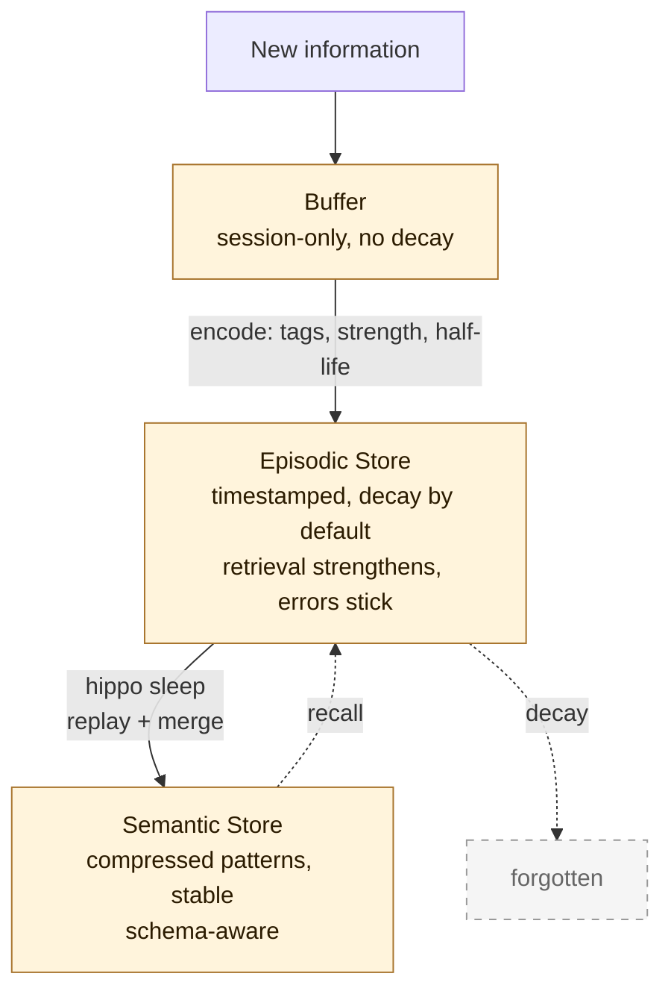
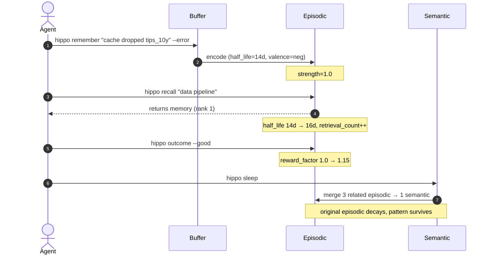

# 🦛 Hippo

**The secret to good memory isn't remembering more. It's knowing what to forget.**

[](https://npmjs.com/package/hippo-memory)
[](./LICENSE)
[](https://hippo-memory.com)

<p align="center">
  
</p>

A memory layer for AI agents. Modeled on the hippocampus. Decay by default, strength through use, provenance on every memory. SQLite under the hood, zero runtime deps, works with every CLI agent you have.

```bash
npm install -g hippo-memory && hippo init --scan ~
```

One command. Every git repo on your machine gets memory.

```
Works with:    Claude Code, Codex, Cursor, OpenClaw, OpenCode, Pi, any MCP client
Imports from:  ChatGPT, Claude (CLAUDE.md), Cursor (.cursorrules), Slack, markdown
Storage:       SQLite backbone with markdown mirrors. Git-trackable, human-readable.
Dependencies:  Zero runtime deps. Node.js 22.5+. Optional embeddings: bring-your-own local Transformers.js (`npm i @huggingface/transformers`, or legacy `@xenova/transformers`) or an opt-in API embedder (OpenAI/Voyage/Cohere). Nothing is auto-installed.
```

---

## Why this exists

Most "AI memory" systems save everything and search later. That's storage with semantic search bolted on. It's why your agent kept hitting the same deploy bug last week. And the week before. The system saw the failure four times. It had no way to know it should remember.

Hippo applies the thing brains have been getting right for 500 million years. Memories decay over time. Retrieval makes them stronger. Three biological layers (buffer, episodic, semantic) consolidate during sleep. Hard lessons stick because you used them. Trivia fades because you didn't.

It also fixes the portability problem. Your ChatGPT memories don't travel to Claude. Your `.cursorrules` don't travel to Codex. Hippo is one process behind every agent. CLAUDE.md, Cursor rules, ChatGPT exports, Slack history, all in one SQLite store, all queryable from any tool that speaks MCP or HTTP.

---

## Receipts

Numbers, not adjectives. Every claim links to the benchmark or the test that proves it.

- **Sequential Learning Benchmark.** [benchmarks/sequential-learning/](benchmarks/sequential-learning/). 50 tasks, 10 buried traps. Measures whether agents learn from past mistakes, not just retrieve text. v0.11.0 informal magnitude RETRACTED v1.7.9; mechanism remains shipped. See [CHANGELOG.md](./CHANGELOG.md) v1.7.9 entry.
- **R@5 = 74.0%** on [LongMemEval](benchmarks/longmemeval/). 500-question industry retrieval benchmark, BM25 only, no embeddings.
- **10 of 10 incident scenarios beat transcript replay** on a staged Slack corpus ([benchmarks/e1.3/](benchmarks/e1.3/)). Recall surfaces the cause faster than scrolling the last N messages.
- **0 outbound HTTP** on the 1000-event ingestion smoke. Proven by a `globalThis.fetch` spy that throws on call, not a hardcoded zero.
- **926 tests, real DB, zero mocks.** Project rule. The one mocks-vs-prod divergence that bit us early is now the constraint that kept the next ten releases honest.
- **dlPFC goal-conditioned cluster discrimination, 3/3 queries pass** — full goal stack with policy weighting and lifespan-windowed outcome propagation. Per-goal lift on a 3-cluster fixture where BM25 alone cannot discriminate; deterministic test in [`benchmarks/micro/results/b3-depth.json`](benchmarks/micro/results/b3-depth.json).

---

## What it does for your agent

- **Stops repeating mistakes.** Tag a failure with `--tag error` once, the lesson surfaces every time the agent walks back into that part of the code. Errors decay slower than ordinary observations.
- **Survives tool switches.** Use Claude Code on Monday, Cursor on Tuesday, Codex on Wednesday. Same `.hippo/` store. Same memories. Pick up exactly where you left off.
- **Ingests systems of record.** Slack today (`POST /v1/connectors/slack/events`). GitHub, Jira, Notion next. Webhooks land as `kind='raw'` memories with full provenance and GDPR-correct deletion.
- **Knows where every memory came from.** Every row carries `kind`, `scope`, `owner`, and `artifact_ref`. Right-to-be-forgotten is a single API call, not an audit nightmare.
- **Plays nice with multi-tenant.** API keys, scrypt-hashed. Audit log on every mutation. Tenant A literally cannot see tenant B's memories. Proven by negative test.

---

## Quick start

```bash
npm install -g hippo-memory

# Single project
hippo init

# All your projects at once (recommended)
hippo init --scan ~
```

`--scan` finds every git repo under your home directory, creates a `.hippo/` store in each one, and seeds it with lessons from the last 30 days of commit history. One command, instant memory across all your projects.

After setup, `hippo sleep` runs at session end (via auto-installed agent hooks) and does five things:

1. **Learns** from today's git commits
2. **Imports** new entries from Claude Code MEMORY.md files
3. **Consolidates** memories (decay, merge, prune)
4. **Deduplicates** near-identical memories, keeping the stronger copy
5. **Shares** high-value lessons to a global store so they surface in every project

```bash
# Manual usage
hippo remember "FRED cache silently dropped the tips_10y series" --tag error
hippo recall "data pipeline issues" --budget 2000
```

---

Full release history: **[CHANGELOG.md](./CHANGELOG.md)** · [GitHub Releases](https://github.com/kitfunso/hippo-memory/releases)


### Zero-config agent integration

`hippo init` auto-detects your agent framework and wires itself in:

```bash
cd my-project
hippo init

# Initialized Hippo at /my-project
#    Directories: buffer/ episodic/ semantic/ conflicts/
#    Auto-installed claude-code hook in CLAUDE.md
```

If you have a `CLAUDE.md`, it patches it. `AGENTS.md` for Codex/OpenClaw/OpenCode. `.cursorrules` for Cursor. Your agent starts using Hippo on its next session. For Codex session capture, Hippo wraps the codex launcher only when you explicitly opt in with `hippo hook install codex` (init prints the command when it detects Codex; undo anytime with `hippo hook uninstall codex`).

It also registers the current project in Hippo's workspace registry and installs one machine-level daily runner (6:15am). That runner sweeps every registered workspace, runs `hippo learn --git --days 1`, then `hippo sleep`. You get strict daily consolidation without creating one OS task per project.

To skip: `hippo init --no-hooks --no-schedule`

---

## Cross-Tool Import

Your memories shouldn't be locked inside one tool. Hippo pulls them in from anywhere.

```bash
# ChatGPT memory export
hippo import --chatgpt memories.json

# Claude's CLAUDE.md (skips existing hippo hook blocks)
hippo import --claude CLAUDE.md

# Cursor rules
hippo import --cursor .cursorrules

# Any markdown file (headings become tags)
hippo import --markdown MEMORY.md

# Any text file
hippo import --file notes.txt
```

All import commands support `--dry-run` (preview without writing), `--global` (write to `~/.hippo/`), and `--tag` (add extra tags). Duplicates are detected and skipped automatically.

### Conversation Capture

Extract memories from raw conversation text. No LLM needed: pattern-based heuristics find decisions, rules, errors, and preferences.

```bash
# Pipe a conversation in
cat session.log | hippo capture --stdin

# Or point at a file
hippo capture --file conversation.md

# Preview first
hippo capture --file conversation.md --dry-run
```

### Slack ingestion (E1.3)

Hippo accepts Slack Events API webhooks at `POST /v1/connectors/slack/events`. Configure `SLACK_SIGNING_SECRET` (validated on every request) and point Slack at `https://<your-host>/v1/connectors/slack/events`. Messages land as `kind='raw'` memories with `slack://team/channel/ts` provenance and a `slack:public:Cxxx` or `slack:private:Cxxx` scope. Source deletions are honored (GDPR).

Backfill an existing channel: `SLACK_BOT_TOKEN=xoxb-... hippo slack backfill --channel C0000`. Inspect malformed events: `hippo slack dlq list`.

Multi-workspace deployments populate `slack_workspaces (team_id, tenant_id)` to route events per tenant; single-workspace falls back to `HIPPO_TENANT`.

### Active task snapshots

Long-running work needs short-term continuity, not just long-term memory. Hippo can persist the current in-flight task so a later `continue` has something concrete to recover.

```bash
hippo snapshot save \
  --task "Ship SQLite backbone" \
  --summary "Tests/build/smoke are green, next slice is active-session recovery" \
  --next-step "Implement active snapshot retrieval in context output"

hippo snapshot show
hippo context --auto --budget 1500
hippo snapshot clear
```

`hippo context --auto` includes the active task snapshot before long-term memories, so agents get both the immediate thread and the deeper lessons.

### Session event trails

Manual snapshots are useful, but real work also needs a breadcrumb trail. Hippo can now store short session events and link them to the active snapshot so context output shows the latest steps, not just the last summary.

```bash
hippo session log \
  --id sess_20260326 \
  --task "Ship continuity" \
  --type progress \
  --content "Schema migration is done, next step is CLI wiring"

hippo snapshot save \
  --task "Ship continuity" \
  --summary "Structured session events are flowing" \
  --next-step "Surface them in framework hooks" \
  --session sess_20260326

hippo session show --id sess_20260326
hippo context --auto --budget 1500
```

Hippo mirrors the latest trail to `.hippo/buffer/recent-session.md` so you can inspect the short-term thread without opening SQLite.

### Session handoffs

When you're done for the day (or switching to another agent), create a handoff so the next session knows exactly where to pick up:

```bash
hippo handoff create \
  --summary "Finished schema migration, tests green" \
  --next "Wire handoff injection into context output" \
  --session sess_20260403 \
  --artifact src/db.ts

hippo handoff latest              # show the most recent handoff
hippo handoff show 3              # show a specific handoff by ID
hippo session resume              # re-inject latest handoff as context
```

### Working memory

Working memory is a bounded scratchpad for current-state notes. It's separate from long-term memory and gets cleared between sessions.

```bash
hippo wm push --scope repo \
  --content "Investigating flaky test in store.test.ts, line 42" \
  --importance 0.9

hippo wm read --scope repo        # show current working notes
hippo wm clear --scope repo       # wipe the scratchpad
hippo wm flush --scope repo       # flush on session end
```

The buffer holds a maximum of 20 entries per scope. When full, the lowest-importance entry is evicted.

### Explainable recall

See why a memory was returned:

```bash
hippo recall "data pipeline" --why --limit 5

# --- mem_a1b2c3 [episodic] [observed] [local] score=0.847
#     BM25: matched [data, pipeline]; cosine: 0.82
#     ...memory content...
```

---

## How It Works

Input enters the buffer. Important things get encoded into episodic memory. During "sleep," repeated episodes compress into semantic patterns. Weak memories decay and disappear.



---

## Key Features

A memory's life across a typical session, before walking each feature in turn:



### Decay by default

Every memory has a half-life. 7 days by default. Persistence is earned.

```bash
hippo remember "always check cache contents after refresh"
# stored with half_life: 7d, strength: 1.0

# 14 days later with no retrieval:
hippo inspect mem_a1b2c3
# strength: 0.25  (decayed by 2 half-lives)
# at risk of removal on next sleep
```

---

### Retrieval strengthens

Use it or lose it. Each recall boosts the half-life by 2 days.

```bash
hippo recall "cache issues"
# finds mem_a1b2c3, retrieval_count: 1 -> 2
# half_life extended: 7d -> 9d
# strength recalculated from retrieval timestamp

hippo recall "cache issues"   # again next week
# retrieval_count: 2 -> 3
# half_life: 9d -> 11d
# this memory is learning to survive
```

---

### Active invalidation

When you migrate from one tool to another, old memories about the replaced tool should die immediately. Hippo detects migration and breaking-change commits during `hippo learn --git` and actively weakens matching memories.

```bash
hippo learn --git
# feat: migrate from webpack to vite
#    Invalidated 3 memories referencing "webpack"
#    Learned: migrate from webpack to vite
```

You can also invalidate manually:

```bash
hippo invalidate "REST API" --reason "migrated to GraphQL"
# Invalidated 5 memories referencing "REST API".
```

---

### Architectural decisions

One-off decisions don't repeat, so they can't earn their keep through retrieval alone. `hippo decide` stores them with a 90-day half-life and verified confidence so they survive long enough to matter.

```bash
hippo decide "Use PostgreSQL for all new services" --context "JSONB support"
# Decision recorded: mem_a1b2c3

# Later, when the decision changes:
hippo decide "Use CockroachDB for global services" \
  --context "Need multi-region" \
  --supersedes mem_a1b2c3
# Superseded mem_a1b2c3 (half-life halved, marked stale)
# Decision recorded: mem_d4e5f6
```

---

### Error memories stick

Tag a memory as an error and it gets 2x the half-life automatically.

```bash
hippo remember "deployment failed: forgot to run migrations" --error
# half_life: 14d instead of 7d
# emotional_valence: negative
# strength formula applies 2.0x multiplier (HIPPO_LOSS_AVERSION_RATIO=0.75 to keep v1.13.4 1.5x)

# production incidents don't fade quietly
```

---

### Confidence tiers

Every memory carries a confidence level: `verified`, `observed`, `inferred`, or `stale`. This tells agents how much to trust what they're reading.

```bash
hippo remember "API rate limit is 100/min" --verified
hippo remember "deploy usually takes ~3 min" --observed
hippo remember "the flaky test might be a race condition" --inferred
```

When context is generated, confidence is shown inline:

```
[verified] API rate limit is 100/min per the docs
[observed] Deploy usually takes ~3 min
[inferred] The flaky test might be a race condition
```

Agents can see at a glance what's established fact vs. a pattern worth questioning.

Memories unretrieved for 30+ days are automatically marked `stale` during the next `hippo sleep`. If one gets recalled again, Hippo wakes it back up to `observed` so it can earn trust again instead of staying permanently stale.

### Conflict tracking

Hippo detects obvious contradictions between overlapping memories and keeps them visible instead of silently letting both masquerade as truth. Shared tags alone do not count; the statements themselves need to overlap in content.

```bash
hippo sleep       # refreshes open conflicts
hippo conflicts   # inspect them
```

Open conflicts are stored in SQLite, mirrored under `.hippo/conflicts/`, and linked back into each memory's `conflicts_with` field.

---

### Observation framing

Memories aren't presented as bare assertions. By default, Hippo frames them as observations with dates, so agents treat them as context rather than commands.

```bash
hippo context --framing observe   # default
# Output: "Previously observed (2026-03-10): deploy takes ~3 min"

hippo context --framing suggest
# Output: "Consider: deploy takes ~3 min"

hippo context --framing assert
# Output: "Deploy takes ~3 min"
```

Three modes: `observe` (default), `suggest`, `assert`. Choose based on how directive you want the memory to be.

---

### Sleep consolidation

Run `hippo sleep` and episodes compress into patterns.

```bash
hippo sleep

# Running consolidation...
#
# Results:
#    Active memories:    23
#    Removed (decayed):   4
#    Merged episodic:     6
#    New semantic:        2
```

Three or more related episodes get merged into a single semantic memory. The originals decay. The pattern survives.

**Experimental: learned memory-value rescue (opt-in, default off).** With
`{"memoryValue":{"enabled":true}}` in `.hippo/config.json`, sleep consults a learned
linear memory-value scorer before deleting a decayed memory: a memory that scores in the
top 30% of its tenant by learned value is kept ("rescued") even though its strength fell
below the decay threshold. The scorer can only rescue, never delete — with the flag on,
sleep deletes a strict subset of what it would delete with the flag off. Every rescue is
recorded in the audit log (`hippo audit list --op mv_rescue`). The weights were learned
on the LongMemEval retention benchmark (held-out retention 0.4897 vs 0.4203 for the best
hand-set baseline); caveat: their usage-feature signs reflect that benchmark's simulated
usage, NOT real usage value — treat the flag as an experiment, not a recommendation.
Tenants with fewer than 10 non-pinned memories never rescue (rank statistics are noise at
tiny scale).

---

### Outcome feedback

Did the recalled memories actually help? Tell Hippo. It tightens the feedback loop.

```bash
hippo recall "why is the gold model broken"
# ... you read the memories and fix the bug ...

hippo outcome --good
# Applied positive outcome to 3 memories
# reward factor increases, decay slows

hippo outcome --bad
# Applied negative outcome to 3 memories
# reward factor decreases, decay accelerates
```

Outcomes are cumulative. A memory with 5 positive outcomes and 0 negative has a reward factor of ~1.42, making its effective half-life 42% longer. A memory with 0 positive and 3 negative has a factor of ~0.63, decaying nearly twice as fast. Mixed outcomes converge toward neutral (1.0).

---

### Token budgets

Recall only what fits. No context stuffing.

```bash
# fits within Claude's 2K token window for task context
hippo recall "deployment checklist" --budget 2000

# need more for a big task
hippo recall "full project history" --budget 8000

# machine-readable for programmatic use
hippo recall "api errors" --budget 1000 --json
```

Results are ranked by `relevance * strength * recency`. The highest-signal memories fill the budget first.

---

### Auto-learn from git

Hippo can scan your commit history and extract lessons from fix/revert/bug commits automatically.

```bash
# Learn from the last 7 days of commits
hippo learn --git

# Learn from the last 30 days
hippo learn --git --days 30

# Scan multiple repos in one pass
hippo learn --git --repos "~/project-a,~/project-b,~/project-c"
```

The `--repos` flag accepts comma-separated paths. Hippo scans each repo's git log, extracts fix/revert/bug lessons, deduplicates against existing memories, and stores new ones. Pair with `hippo sleep` afterwards to consolidate.

Ideal for a weekly cron:

```bash
hippo learn --git --repos "~/repo1,~/repo2" --days 7
hippo sleep
```

---

### Watch mode

Wrap any command with `hippo watch` to auto-learn from failures:

```bash
hippo watch "npm run build"
# if it fails, Hippo captures the error automatically
# next time an agent asks about build issues, the memory is there
```

---

## CLI Reference

| Command | What it does |
|---------|-------------|
| `hippo init` | Create `.hippo/` + auto-install agent hooks |
| `hippo init --global` | Create global store at `~/.hippo/` |
| `hippo init --no-hooks` | Create `.hippo/` without auto-installing hooks |
| `hippo remember "<text>"` | Store a memory |
| `hippo remember "<text>" --tag <t>` | Store with tag (repeatable) |
| `hippo remember "<text>" --error` | Store as error (2x half-life) |
| `hippo remember "<text>" --pin` | Store with no decay |
| `hippo remember "<text>" --verified` | Set confidence: verified (default) |
| `hippo remember "<text>" --observed` | Set confidence: observed |
| `hippo remember "<text>" --inferred` | Set confidence: inferred |
| `hippo remember "<text>" --global` | Store in global `~/.hippo/` store |
| `hippo recall "<query>"` | Retrieve relevant memories (local + global) |
| `hippo recall "<query>" --budget <n>` | Recall within token limit (default: 4000) |
| `hippo recall "<query>" --limit <n>` | Cap result count |
| `hippo recall "<query>" --why` | Show match reasons and source buckets |
| `hippo recall "<query>" --hops <n>` | Also surface memories N hops away in the entity/relation graph (0..3, default off) |
| `hippo recall "<query>" --json` | Output as JSON |
| `hippo context --auto` | Smart context injection (auto-detects task from git) |
| `hippo context "<query>" --budget <n>` | Context injection with explicit query (default: 1500) |
| `hippo context --limit <n>` | Cap memory count in context |
| `hippo context --budget 0` | Skip entirely (zero token cost) |
| `hippo context --framing <mode>` | Framing: observe (default), suggest, assert |
| `hippo context --format <fmt>` | Output format: markdown (default) or json |
| `hippo import --chatgpt <path>` | Import from ChatGPT memory export (JSON or txt) |
| `hippo import --claude <path>` | Import from CLAUDE.md or Claude memory.json |
| `hippo import --cursor <path>` | Import from .cursorrules or .cursor/rules |
| `hippo import --markdown <path>` | Import from structured markdown (headings -> tags) |
| `hippo import --file <path>` | Import from any text file |
| `hippo import --dry-run` | Preview import without writing |
| `hippo import --global` | Write imported memories to `~/.hippo/` |
| `hippo capture --stdin` | Extract memories from piped conversation text |
| `hippo capture --file <path>` | Extract memories from a file |
| `hippo capture --dry-run` | Preview extraction without writing |
| `hippo sleep` | Run consolidation (decay + merge + compress) |
| `hippo sleep --dry-run` | Preview consolidation without writing |
| `hippo status` | Memory health: counts, strengths, last sleep |
| `hippo outcome --good` | Strengthen last recalled memories |
| `hippo outcome --bad` | Weaken last recalled memories |
| `hippo outcome --id <id> --good` | Target a specific memory |
| `hippo inspect <id>` | Full detail on one memory |
| `hippo forget <id>` | Force remove a memory |
| `hippo embed` | Embed all memories for semantic search |
| `hippo embed --status` | Show embedding coverage |
| `hippo watch "<command>"` | Run command, auto-learn from failures |
| `hippo learn --git` | Scan recent git commits for lessons |
| `hippo learn --git --days <n>` | Scan N days back (default: 7) |
| `hippo learn --git --repos <paths>` | Scan multiple repos (comma-separated) |
| `hippo daily-runner` | Sweep registered workspaces and run daily learn+sleep |
| `hippo conflicts` | List detected open memory conflicts |
| `hippo conflicts --json` | Output conflicts as JSON |
| `hippo resolve <id>` | Show both conflicting memories for comparison |
| `hippo resolve <id> --keep <mem_id>` | Resolve: keep winner, weaken loser |
| `hippo resolve <id> --keep <mem_id> --forget` | Resolve: keep winner, delete loser |
| `hippo promote <id>` | Copy a local memory to the global store |
| `hippo share <id>` | Share with attribution + transfer scoring |
| `hippo share <id> --force` | Share even if transfer score is low |
| `hippo share --auto` | Auto-share all high-scoring memories |
| `hippo share --auto --dry-run` | Preview what would be shared |
| `hippo peers` | List projects contributing to global store |
| `hippo sync` | Pull global memories into local project |
| `hippo invalidate "<pattern>"` | Actively weaken memories matching an old pattern |
| `hippo invalidate "<pattern>" --reason "<why>"` | Include what replaced it |
| `hippo decide "<decision>"` | Record architectural decision (90-day half-life) |
| `hippo decide "<decision>" --context "<why>"` | Include reasoning |
| `hippo decide "<decision>" --supersedes <id>` | Supersede a previous decision |
| `hippo hook list` | Show available framework hooks |
| `hippo hook install <target>` | Install hook (claude-code also adds Stop hook for auto-sleep) |
| `hippo hook uninstall <target>` | Remove hook |
| `hippo handoff create --summary "..."` | Create a session handoff |
| `hippo handoff latest` | Show the most recent handoff |
| `hippo handoff show <id>` | Show a specific handoff by ID |
| `hippo session latest` | Show latest task snapshot + events |
| `hippo session resume` | Re-inject latest handoff as context |
| `hippo current show` | Compact current state (task + session events) |
| `hippo wm push --scope <s> --content "..."` | Push to working memory |
| `hippo wm read --scope <s>` | Read working memory entries |
| `hippo wm clear --scope <s>` | Clear working memory |
| `hippo wm flush --scope <s>` | Flush working memory (session end) |
| `hippo dashboard` | Open web dashboard at localhost:3333 |
| `hippo dashboard --port <n>` | Use custom port |
| `hippo mcp` | Start MCP server (stdio transport) |

---

## Framework Integrations

### Auto-install (recommended)

`hippo init` detects your agent framework and patches the right config file automatically:

| Framework | Detected by | Patches |
|-----------|------------|---------|
| Claude Code | `CLAUDE.md` or `.claude/settings.json` | `CLAUDE.md` + `SessionStart`/`SessionEnd` hooks in `settings.json` |
| Codex | `AGENTS.md` or `.codex` | `AGENTS.md` + automatic in-place Codex launcher wrapper |
| Cursor | `.cursorrules` or `.cursor/rules` | `.cursorrules` |
| OpenClaw | `.openclaw` or `AGENTS.md` | native OpenClaw plugin or `AGENTS.md` |
| OpenCode | `.opencode/` or `opencode.json` | `AGENTS.md` + TS plugin at `~/.config/opencode/plugins/hippo.ts` (subscribes to `session.idle` + `session.created`) |

No extra commands needed. Just `hippo init` and your agent knows about Hippo.

### Manual install

If you prefer explicit control:

```bash
hippo hook install claude-code   # patches CLAUDE.md + adds SessionStart/SessionEnd + UserPromptSubmit hooks
hippo hook install codex         # optional repair/manual run: patches AGENTS.md + wraps the detected Codex launcher
hippo hook install cursor        # patches .cursorrules
hippo hook install openclaw      # patches AGENTS.md
hippo hook install opencode      # patches AGENTS.md + installs the opencode TS plugin
```

This adds a `<!-- hippo:start -->` ... `<!-- hippo:end -->` block that tells the agent to:
1. Run `hippo context --auto --budget 1500` at session start
2. Run `hippo remember "<lesson>" --error` on errors
3. Run `hippo outcome --good` on completion

For Claude Code, it also adds:
- a `SessionEnd` hook so `hippo sleep` runs automatically when the session exits
- a `SessionStart` hook that prints the previous session's consolidation output
- a `UserPromptSubmit` hook that runs `hippo context --pinned-only --include-recent 5 --format additional-context` every turn. It re-injects pinned memories (`hippo remember <text> --pin`) plus the last 5 writes, so fresh same-session lessons appear on the next prompt before you pin them. Opt out with `{"pinnedInject":{"enabled":false}}` in `.hippo/config.json`.
- a `PreCompact` hook that runs `hippo pre-compact` before the transcript gets summarized. It saves a working-state snapshot (task/summary/next step) and extracts durable memories from the tail, so mid-session compaction can't drop them.
- a second `SessionStart` hook (matcher `compact`) that runs `hippo compact-resume`, printing that snapshot plus the recent session trail back into context right after compaction.

To remove: `hippo hook uninstall claude-code`

### What the hook adds (Claude Code example)

```markdown
## Project Memory (Hippo)

Before starting work, load relevant context:
hippo context --auto --budget 1500

When you hit an error or discover a gotcha:
hippo remember "<what went wrong and why>" --error

After completing work successfully:
hippo outcome --good
```

### MCP Server

For any MCP-compatible client (Cursor, Windsurf, Cline, Claude Desktop):

```bash
hippo mcp   # starts MCP server over stdio
```

Add to your MCP config (e.g. `.cursor/mcp.json` or `claude_desktop_config.json`):

```json
{
  "mcpServers": {
    "hippo-memory": {
      "command": "hippo",
      "args": ["mcp"]
    }
  }
}
```

Exposes tools: `hippo_recall`, `hippo_remember`, `hippo_outcome`, `hippo_context`, `hippo_status`, `hippo_learn`, `hippo_wm_push`.

### OpenClaw Plugin

Native plugin with auto-context injection, workspace-aware memory lookup, and
tool hooks for auto-learn / auto-sleep. When `autoSleep` is enabled, the
OpenClaw plugin now launches `hippo sleep` in a detached background worker at
session end so the live session can exit immediately.

Query-time retrieval still uses the active workspace store plus the shared
global store. Daily consolidation comes from the machine-level runner that
`hippo init` / `hippo setup` installs.

```bash
openclaw plugins install hippo-memory
openclaw plugins enable hippo-memory
```

Plugin docs: [extensions/openclaw-plugin/](extensions/openclaw-plugin/). Integration guide: [integrations/openclaw.md](integrations/openclaw.md).

### Claude Code Plugin

Plugin with SessionStart/Stop hooks and error auto-capture. See [extensions/claude-code-plugin/](extensions/claude-code-plugin/).

Full integration details: [integrations/](integrations/)

---

## The Neuroscience

Hippo is modeled on seven properties of the human hippocampus. Not metaphorically. Literally.

**Why two stores?** The brain uses a fast hippocampal buffer + a slow neocortical store (Complementary Learning Systems theory, McClelland et al. 1995). If the neocortex learned fast, new information would overwrite old knowledge. The buffer absorbs new episodes; the neocortex extracts patterns over time.

**Why does decay help?** New neurons born in the dentate gyrus actively disrupt old memory traces (Frankland et al. 2013). This is adaptive: it reduces interference from outdated information. Forgetting isn't failure. It's maintenance.

**Why do errors stick?** The amygdala modulates hippocampal consolidation based on emotional significance. Fear and error signals boost encoding. Your first production incident is burned into memory. Your 200th uneventful deploy isn't.

**Why does retrieval strengthen?** Recalled memories undergo "reconsolidation" (Nader et al. 2000). The act of retrieval destabilizes the trace, then re-encodes it stronger. This is the testing effect. Hippo implements it mechanically via the half-life extension on recall.

**Why does sleep consolidate?** During sleep, the hippocampus replays compressed versions of recent episodes and "teaches" the neocortex by repeatedly activating the same patterns. Hippo's `sleep` command runs this as a deliberate consolidation pass.

The 7 mechanisms in full: [PLAN.md#core-principles](PLAN.md#core-principles)

For how these mechanisms connect to LLM training, continual learning, and open research problems: **[RESEARCH.md](RESEARCH.md)**

**Why does reward modulate decay?** In spiking neural networks, reward-modulated STDP strengthens synapses that contribute to positive outcomes and weakens those that don't. Hippo's reward-proportional decay (v0.11.0) implements this: memories with consistent positive outcomes decay slower, negatives decay faster, with no fixed deltas. Inspired by [MH-FLOCKE](https://github.com/MarcHesse/mhflocke)'s R-STDP architecture for quadruped locomotion, where the same mechanism produces stable learning with 11.6x lower variance than PPO.

**Prior art in agent memory simulation.** The idea that human-like memory produces human-like behavior as an emergent property was explored in IEEE research from 2010-2011 ([5952114](https://ieeexplore.ieee.org/document/5952114), [5548405](https://ieeexplore.ieee.org/document/5548405), [5953964](https://ieeexplore.ieee.org/document/5953964)). Walking between rooms and forgetting why you went there doesn't need direct simulation; it emerges naturally from a memory system with capacity limits and decay. Hippo's design follows the same principle: implement the mechanisms, and the behavior follows.

**Related work:** [HippoRAG](https://arxiv.org/abs/2405.14831) (Gutierrez et al., 2024) applies hippocampal indexing to RAG via knowledge graphs. [MemPalace](https://github.com/milla-jovovich/mempalace) (Sigman & Jovovich, 2026) organizes memory spatially (wings/halls/rooms) with AAAK compression, achieving 100% on [LongMemEval](https://arxiv.org/abs/2410.10813). [MH-FLOCKE](https://github.com/MarcHesse/mhflocke) (Hesse, 2026) uses spiking neurons with R-STDP for embodied cognition. Each system tackles a different facet: HippoRAG optimizes retrieval quality, MemPalace optimizes retrieval organization, MH-FLOCKE optimizes embodied learning, and Hippo optimizes memory lifecycle.

---

## Comparison

The AI-memory category matured fast in 2026. Hippo's specific take — bio-decay, strengthen-on-use, outcome-weighted half-lives — is one stance among several. The table below is a feature snapshot, not a verdict: graph-first systems ([gbrain](https://hermesatlas.com/projects/garrytan/gbrain), [Zep](https://www.getzep.com/), [Cognee](https://www.cognee.ai/)), agent-managed systems ([Letta](https://github.com/letta-ai/letta)), and version-control / skill-distillation takes ([Memoria](https://github.com/matrixorigin/Memoria), [EverMind](https://evermind.ai/)) all solve adjacent problems with different mechanics.

| Feature | Hippo | [MemPalace](https://github.com/milla-jovovich/mempalace) | [Mem0](https://github.com/mem0ai/mem0) | [Basic Memory](https://github.com/basicmachines-co/basic-memory) | [gbrain](https://hermesatlas.com/projects/garrytan/gbrain) | [Zep](https://www.getzep.com/) | [Letta](https://github.com/letta-ai/letta) | [Cognee](https://www.cognee.ai/) | [Memoria](https://github.com/matrixorigin/Memoria) | [EverMind](https://evermind.ai/) |
|---------|-------|-----------|------|-------------|--------|-----|-------|--------|---------|----------|
| Decay by default | Yes | No | No | No | No | No | No | No | No | No |
| Retrieval strengthening | Yes | No | No | No | No | No | No | Partial (recall tuning) | No | Partial (Skill Memory distills patterns) |
| Reward-proportional decay | Yes | No | No | No | No | No | No | No | No | No |
| Hybrid search (BM25 + embeddings) | Yes | Embeddings + spatial | Embeddings only | No | Yes (vec + rerank + graph) | Yes (graph + vec) | ? | Yes (GraphRAG) | Yes (vector + full-text) | Yes (mRAG, multi-modal) |
| Schema acceleration / knowledge graph | Yes (schema) | No | No | No | Yes (typed KG, self-wiring) | Yes (temporal KG) | No | Yes (auto-ontologies) | No (typed claims) | Yes (hierarchical: user/group/agent) |
| Conflict detection + resolution | Yes | No | No | No | Yes (eval-surfaced) | Yes (auto-invalidate stale facts) | No | No | Yes (auto-detect + quarantine) | Partial (temporal tracking) |
| Multi-agent shared memory | Yes | No | No | No | Yes (brain repo, team mounts) | Yes | No (single-agent state) | Yes | Yes (branch/merge across sessions) | Yes (multi-agent coordination) |
| Transfer scoring | Yes | No | No | No | No | No | No | No | No | No |
| Outcome tracking | Yes | No | No | No | No | No | No | No | No | Partial (Cases: agent trajectories) |
| Confidence tiers | Yes | No | No | No | No (typed facts) | No | No | No | No | No |
| Spatial organization | No | Yes (wings/halls/rooms) | No | No | No | No | No | No | No | No |
| Lossless compression | No | Yes (AAAK, 30x) | No | No | No | No | No | No | No | No |
| Cross-tool import (ChatGPT/Claude/Cursor) | Yes | No | No | No | Partial (data sources) | ? | No | Partial (28 data sources) | No (Git ops) | Partial (mRAG: PDFs/images/URLs) |
| Auto-hook install | Yes | No | No | No | No | No | No | No | No | No |
| MCP server | Yes | Yes | No | No | Yes (stdio + HTTP/OAuth) | Partial (managed) | Yes (via Letta Code) | Yes (first-party Claude/LangGraph) | Yes | ? |
| Zero runtime deps | Yes | No (ChromaDB) | No | No | No (PGLite or PG+pgvector) | No (managed service) | No (Python deps) | No (Python deps) | Yes (single Rust binary) | No (managed + OSS) |
| LongMemEval (best published) | 98.6% default / 99.8% voyage R@5 (s_cleaned, per-haystack)\* | 96.6% raw / 100% reranked R@5 | ~49-85% R@5 | N/A | 97.6-97.9% R@5 (s_cleaned\*) | N/A (LoCoMo 80.3%) | N/A | N/A | 88.78% overall accuracy w/ reader\*\* | 83.00% overall\*\* (LoCoMo 93.05%, HaluMem 93.04%) |
| Git-friendly | Yes | No | No | Yes | Yes | No | No | No | Yes (Git is the model) | ? |
| Framework agnostic | Yes | Yes | Partial | Yes | Yes | Yes | Yes | Yes | Yes | Yes |
| License | MIT | (open) | Apache-2.0 | (open) | MIT | Apache-2.0 (community) | Apache-2.0 | MIT (core) | Apache-2.0 | Apache-2.0 (OSS) + cloud |

\* Hippo's 98.6% (zero-dep default) and 99.8% (voyage-3-large) are on `longmemeval_s_cleaned`, per-question haystack, directly comparable to gbrain's 97.6% on the same split and metric (measured 2026-06-09, see [`docs/evals/2026-06-09-longmemeval-per-haystack-dual.md`](docs/evals/2026-06-09-longmemeval-per-haystack-dual.md)). gbrain's figure is their published claim. An older hippo number, 86.8% R@5 on `longmemeval_oracle` under pooled (non-per-haystack) retrieval, is not comparable to per-haystack figures.

\*\* Different metric: Memoria's 88.78% and EverMind's 83% are reported as overall accuracy with a reader LLM, not retrieval R@5. Higher denominator + LLM helps. Not directly comparable to retrieval-only R@5 numbers above.

Different tools answer different questions. Mem0 and Basic Memory implement "save everything, search later." MemPalace implements "store everything, organize spatially for retrieval." gbrain, Zep, and Cognee implement "extract typed entities and relationships into a knowledge graph." Letta implements "the agent edits its own memory blocks." Memoria implements "Git-style version control over the memory state itself." EverMind implements "self-evolving Skill Memory + multi-modal retrieval over hierarchical scopes." Hippo implements "forget by default, earn persistence through use." These are complementary takes, not a single-axis ranking: bio-lifecycle (Hippo) + GraphRAG (gbrain/Cognee/Zep) + agent-self-edit (Letta) + memory-VCS (Memoria) + skill-distillation (EverMind) cover different parts of the same problem.

---

## Benchmarks

Three benchmarks testing three different things. Full details in [`benchmarks/`](benchmarks/).

### LongMemEval (retrieval accuracy)

[LongMemEval](https://arxiv.org/abs/2410.10813) (ICLR 2025) is the industry-standard benchmark: 500 questions across 5 memory abilities, embedded in 115k+ token chat histories.

**Standard per-haystack result (`_s` split, measured 2026-06-09).** Each question is scored against its own ~48-session haystack, the same way gbrain and other published systems report. The v1.23.0 pluggable embedding provider lets you choose the embedder:

| Embedder | Dense-only R@5 | Best hybrid R@5 | R@1 |
|----------|----------------|-----------------|-----|
| MiniLM-L6 (zero-dependency default) | 96.6 | 98.6 | 89.6 |
| voyage-3-large (opt-in) | 99.8 | 99.8 | 94.6 |

gbrain reports 97.6 R@5 on this split with a paid frontier embedder. Hippo's free, local, zero-dependency default reaches 98.6. Retrieval recall on the standard task is effectively saturated, so the embedder is a swappable commodity, not the differentiator. Method and the global-pool comparison: [`docs/evals/2026-06-09-longmemeval-per-haystack-dual.md`](docs/evals/2026-06-09-longmemeval-per-haystack-dual.md).

The differentiator is what happens as one store grows. Point retrieval at a single unified memory of tens of thousands of sessions, with no pre-scoped haystack, and recall stops being free (default 47, voyage 56 on the 19,195-session `_s` store). That is where memory lifecycle (decay, consolidation, supersession) earns its keep, and it is what hippo measures next (see ROADMAP Part III).

**Hippo v0.28.0 oracle-split results (hybrid BM25 + cosine, full 500 questions, pooled retrieval):**

| Metric | v0.28 | v0.11 (BM25 only) |
|--------|-------|-------------------|
| Recall@1 | 46.6% | 50.4% |
| Recall@3 | **67.0%** | 66.6% |
| Recall@5 | 73.8% | 74.0% |
| Recall@10 | 81.0% | 82.6% |
| Answer in content@5 | **49.6%** | 46.6% |

| Question Type | Count | R@5 | R@10 |
|---------------|-------|-----|------|
| single-session-assistant | 56 | 100.0% | 100.0% |
| knowledge-update | 78 | 89.7% | 96.2% |
| multi-session | 133 | 72.2% | 82.0% |
| temporal-reasoning | 133 | 72.9% | 78.9% |
| single-session-user | 70 | 62.9% | 71.4% |
| single-session-preference | 30 | 20.0% | 33.3% |

For context: MemPalace scores 96.6% (raw) using ChromaDB embeddings + spatial indexing. Hippo v0.28 achieves 73.8% R@5 with hybrid BM25 + cosine. Hybrid scoring trades a little R@1 accuracy for better top-5 content relevance (answer_in_content@5 +3pp vs v0.11).

Hippo's strongest categories (single-session-assistant 100% R@5, knowledge-update 89.7%) are where keyword overlap between question and stored content is highest. The weakest (preference 20%) involves indirect references that need deeper semantic understanding.

> Note: v0.28 R@10 is 1.6pp below v0.11's BM25-only result. The earlier v0.27 benchmark showed an apparent 35pp regression — that was a methodology bug (budget-limited retrieval vs unlimited), fixed in v0.28 with the `minResults` option. See [`evals/README.md`](evals/README.md) for the full investigation and per-type breakdown.

```bash
cd benchmarks/longmemeval
python ingest_direct.py --data data/longmemeval_oracle.json --store-dir ./store
python retrieve_fast.py --data data/longmemeval_oracle.json --store-dir ./store --output results/retrieval.jsonl
python evaluate_retrieval.py --retrieval results/retrieval.jsonl --data data/longmemeval_oracle.json
```

### LoCoMo (conversational evidence recall)

[LoCoMo](https://arxiv.org/abs/2402.17753) is 10 long multi-session conversations (5,882 turns, 1,986 questions). Hippo scores it with a deterministic metric: did the gold evidence turn land in the top 5 recalled memories? No LLM judge is in the scoring path, so the numbers are not comparable to the LLM-as-judge accuracy Mem0 and Letta publish for LoCoMo.

**v1.25.0 baseline (measured 2026-07-05, single run).** Zero-dependency default embedder (`Xenova/all-MiniLM-L6-v2`), fresh store per conversation, `hippo recall --budget 4000`, top-k 5, 1,982 scored questions:

| Category | n | Evidence recall@5 |
|----------|--:|------------------:|
| single-hop | 282 | 0.239 |
| multi-hop | 321 | 0.491 |
| temporal-reasoning | 92 | 0.169 |
| open-domain | 841 | 0.450 |
| adversarial | 446 | 0.226 |
| **overall** | 1,982 | **0.363** |

Read these as a point estimate, not an exact value: n=1, and the run predates the v1.26.0 determinism fix and the harness fix in [#126](https://github.com/kitfunso/hippo-memory/pull/126) (0.9% of stored rows lost their tags at run time). The table has not been re-run on a newer build. Overall recall is 2.10x the April v0.32.0 baseline under the identical protocol. Informational only, gates no feature. Full protocol, caveats and regeneration commands: [`benchmarks/LOCOMO_INVESTIGATION.md`](benchmarks/LOCOMO_INVESTIGATION.md); harness in [`benchmarks/locomo/`](benchmarks/locomo/).

### Sequential Learning Benchmark (agent improvement over time)

No other public benchmark tests whether memory systems produce learning curves. LongMemEval tests retrieval on a fixed corpus. This benchmark tests whether an agent with memory *performs better on task 40 than task 5*.

50 tasks, 10 trap categories, each appearing 2-3 times across the sequence.

> **v0.11.0 informal results — RETRACTED v1.7.9.** The 78% → 14% magnitude does NOT reproduce on the formal sequential-learning benchmark. Three pre-registered workload variants (v1.7.5 full-late, v1.7.6 budget sweep, v1.7.7 `--restrict-late-to 4`) all returned C2 hippo-base late mean = 0.0% across every seed (the workload's late phase saturates structurally). The mechanism (dlPFC goal-stack: `pushGoal`/`completeGoal` hooks, `--use-goal-stack`) is shipped and exercisable. **The magnitude is RETRACTED. The mechanism is shipped; no magnitude is currently claimed.** v1.8.0 (queued) explores adversarial trap categories as mechanism characterisation under the magnitude-smuggling guard in `docs/RETRACTION.md`. Pre-registration trail: `docs/evals/2026-05-07-v1.7.5-goal-stack-eval-prereg.md`, `docs/evals/2026-05-09-v1.7.6-calibration-result.md`, `docs/evals/2026-05-09-v1.7.7-goal-stack-eval-result.md`. CHANGELOG: see v1.7.9 entry.

<details>
<summary>Original v0.11.0 informal numbers (RETRACTED — preserved as audit trail in git, not reproduced here)</summary>

v0.11.0 reported a single-run informal headline citing late-phase trap-rate decline on the sequential-learning benchmark. The specific numbers are archived at git tag `v0.11.0` and the corresponding `CHANGELOG.md` historical entry. Retained in version control, not reproduced here, since reproduction risks accidental re-citation. See `git show v0.11.0 -- README.md` for the original wording.

</details>

The benchmark, harness, and adapter contract remain shipped. Any memory system can run this benchmark by implementing the [adapter interface](benchmarks/sequential-learning/adapters/interface.mjs).

```bash
cd benchmarks/sequential-learning
node run.mjs --adapter all
```

---

## Contributing

Issues and PRs welcome. Before contributing, run `hippo status` in the repo root to see the project's own memory.

The interesting problems:
- **LongMemEval retrieval (standard task: done).** Per-question-haystack R@5 is 98.6% with the zero-dependency default and 99.8% with voyage-3-large (measured 2026-06-09), at or above the published frontier. Retrieval is no longer the gap; the lifecycle stress eval (ROADMAP Part III) is the next measurement.
- Better consolidation heuristics (LLM-powered merge vs current text overlap)
- Web UI / dashboard for visualizing decay curves and memory health
- Optimal decay parameter tuning from real usage data
- Cross-agent transfer learning evaluation
- **MemPalace-style spatial organization.** Could spatial structure (wings/halls/rooms) improve hippo's semantic layer?
- **AAAK-style compression for semantic memories.** Lossless token compression for context injection.

## License

MIT
